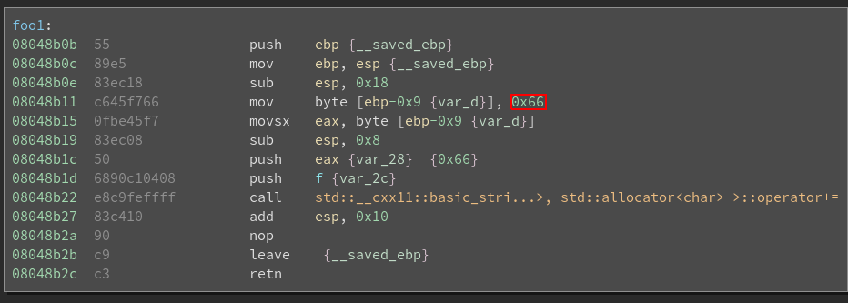

# SwampCTF 2018: Dragon's Horde
### Category: Reverse, Points 159, Solves 278

> You are a member of the dragon slayer's guild within your town.
> Word comes to the guild of a dragon seen in a nearby mountain range.
> You and your party decide to go out and slay the beast.
> There is surely great wealth and glory to be obtained.
> But be careful, dragons can be tricky creatures to deal with.
> 
> -=Created By: matg=-


### Write-up
Dragon's horde is a simple c++ program that will read our input using std::cin, then each character is compared the corresponding character in the flag in the functions foo1() too foo15().

To get the flag we just need to get the char used for the comparasion from each of the foo functions.

```python
flaghex = [ 0x66, 0x6c, 0x61, 0x67, 0x7b, 0x72, 0x33, 0x76, 0x5f, 0x31, 0x74, 0x5f, 0x75, 0x70, 0x7d ]
flag = ""

for f in flaghex:
    flag += chr(f)

print flag
```
> flag{r3v_1t_up}
